# EduAdvisor API

## Academic Guidance and Course Recommendation Platform

### Project Overview

EduAdvisor API is a Full Stack Academic Guidance Platform developed using FastAPI, SQLite, HTML, CSS, and JavaScript.

The system helps students manage academic profiles, explore career opportunities, receive course recommendations, follow personalized learning roadmaps, and simulate GPA outcomes through an interactive web application.

---

## Key Features

### Authentication Module

* User Registration
* User Login
* JWT-Based Authentication

### Student Management

* Add Student Records
* View Student Profiles
* Update Student Information
* Delete Student Records

### Course Management

* Add Courses
* View Available Courses
* Edit Course Details
* Delete Courses

### Academic Guidance

* Career Insights Dashboard
* Personalized Learning Roadmap
* GPA Impact Simulator
* Course Recommendation Engine

---

## Technology Stack

### Backend

* FastAPI
* SQLAlchemy
* SQLite
* Pydantic
* JWT Authentication

### Frontend

* HTML5
* CSS3
* JavaScript

### Development Tools

* Visual Studio Code
* Swagger UI
* GitHub

---

## Project Structure

EduAdvisor-API/

backend/

* auth/
* database/
* models/
* routers/
* schemas/

frontend/

* css/
* js/
* login.html
* signup.html
* dashboard.html
* students.html
* courses.html
* career.html
* roadmap.html
* gpa.html

---

## API Endpoints

### Authentication

* POST /auth/register
* POST /auth/login

### Students

* GET /students
* POST /students
* PUT /students/{id}
* DELETE /students/{id}

### Courses

* GET /courses
* POST /courses
* PUT /courses/{id}
* DELETE /courses/{id}

### Recommendations

* GET /recommendations/{student_id}

### Roadmap

* GET /roadmap/{student_id}

### GPA Simulator

* POST /gpa/predict

---

## How to Run

### Create Virtual Environment

python -m venv .venv

### Activate Environment

Windows:

.venv\Scripts\activate

### Install Dependencies

pip install -r requirements.txt

### Run Application

uvicorn backend.main:app --reload

### Open Swagger Documentation

https://eduadvisor-api.onrender.com/docs

### Run Frontend

Open frontend pages using Live Server in Visual Studio Code.

---

## Future Enhancements

* Cloud Database Integration
* Advanced Student Analytics
* Enhanced Recommendation Algorithms
* Mobile Responsive Design
* Role-Based Access Control

---

# Application Screenshots

## Home Page

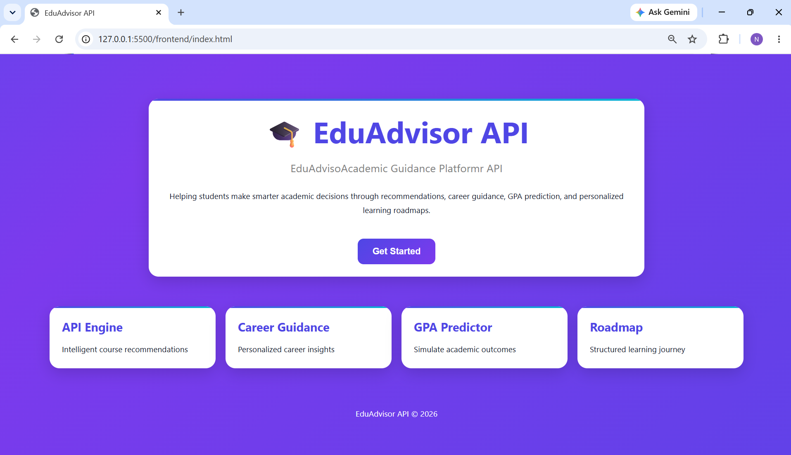

## Login Page

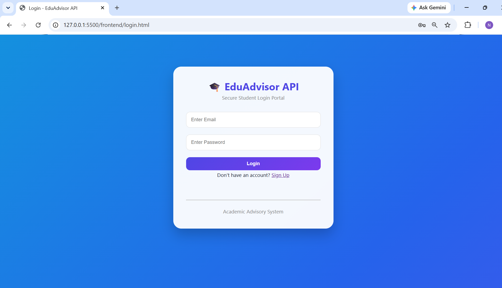

## Signup Page

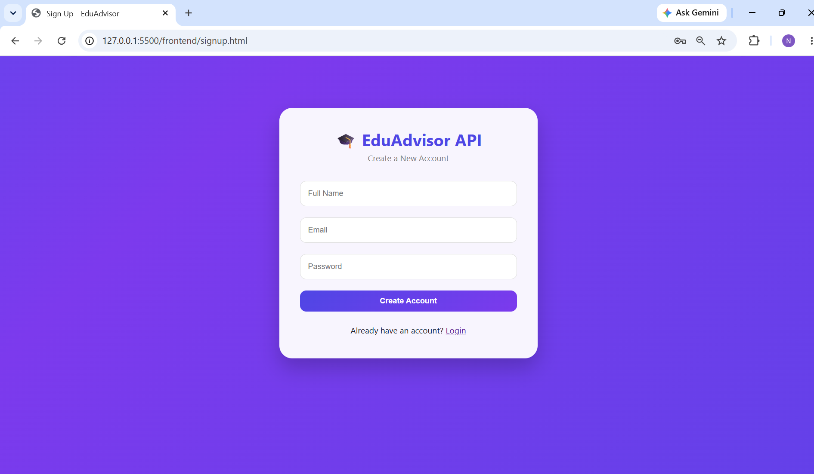

## Dashboard

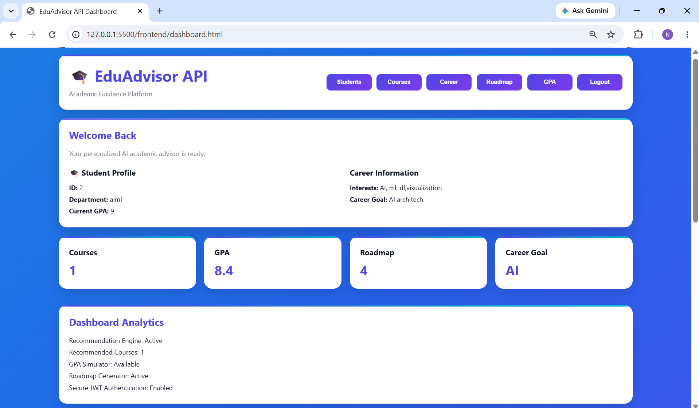

## Dashboard Recommendations

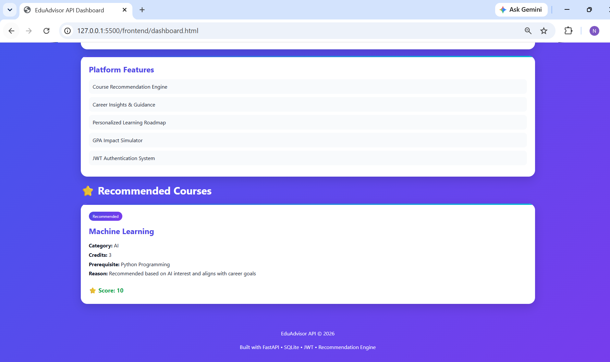

## Student Management

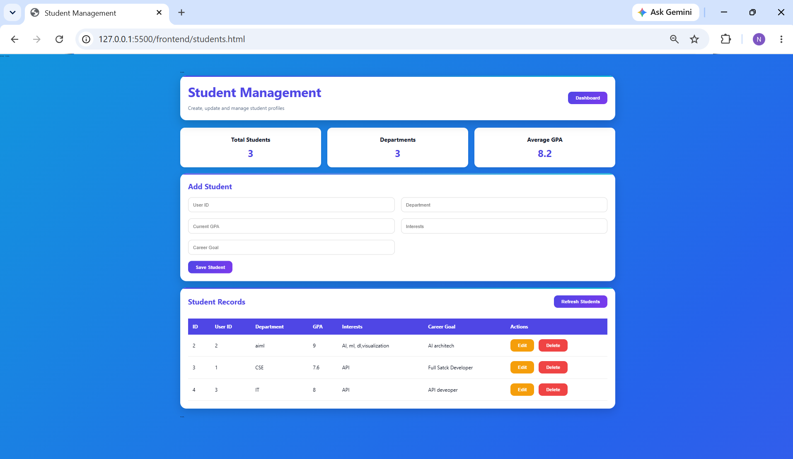

## Course Management

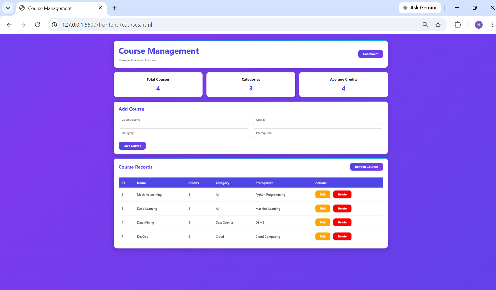

## Career Insights

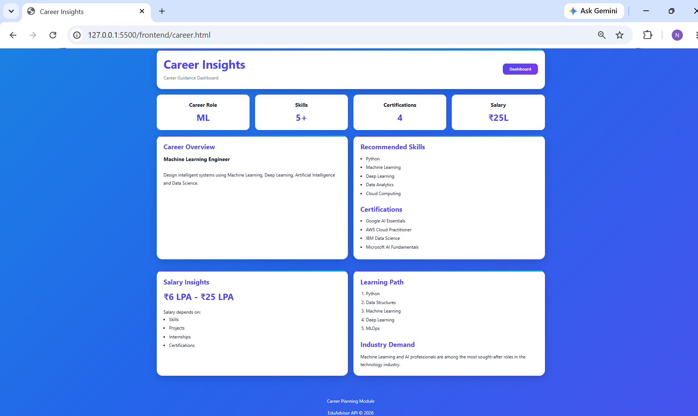

## Learning Roadmap

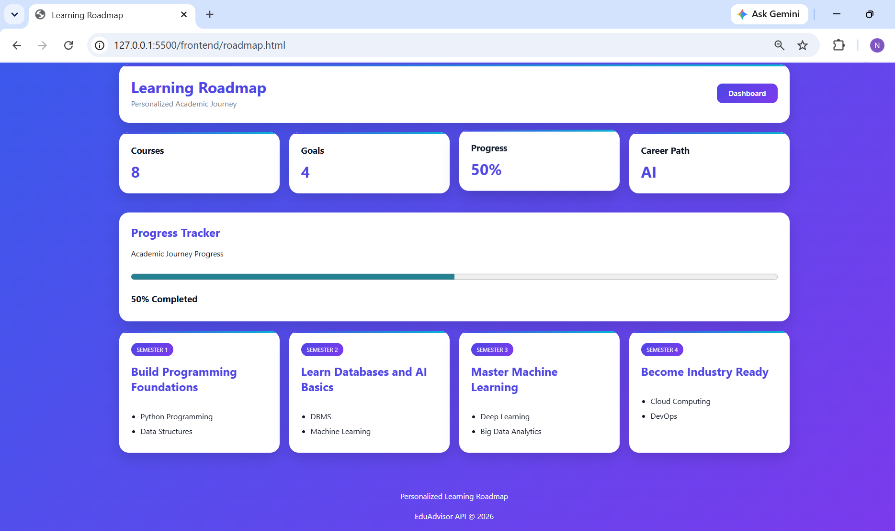

## GPA Simulator

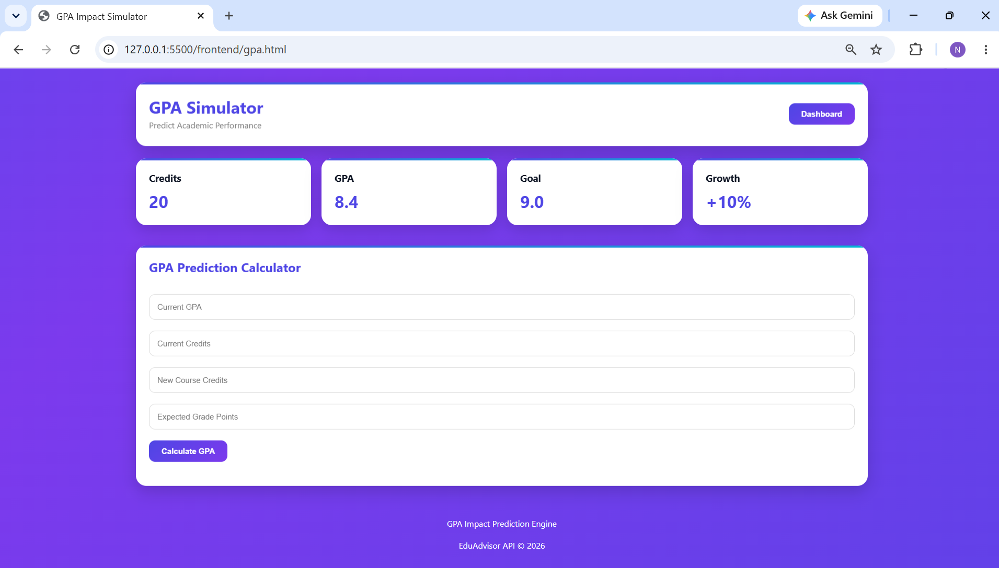

# API Testing Using Thunder Client

## GET Student API

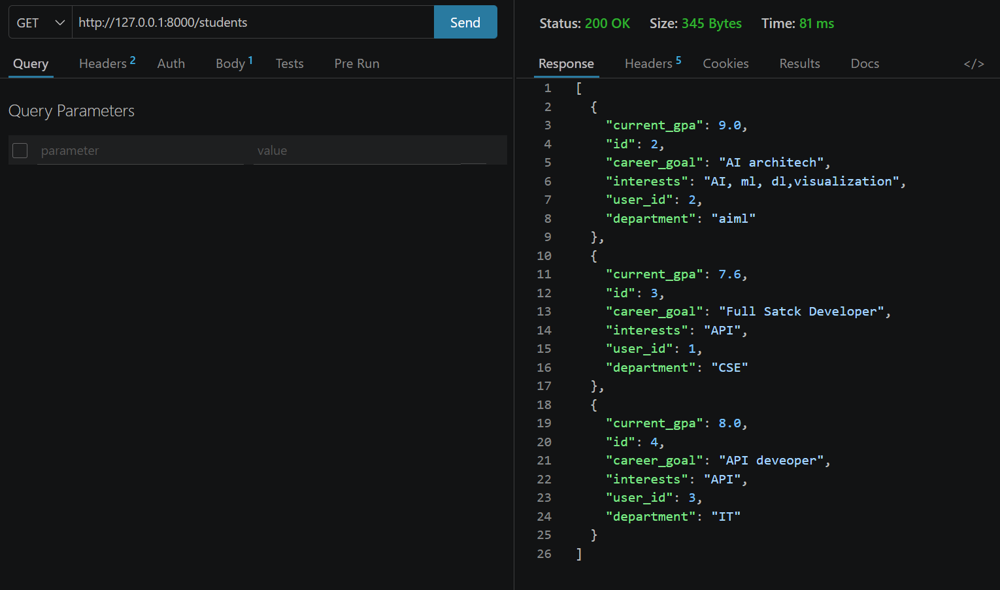

## POST Student API

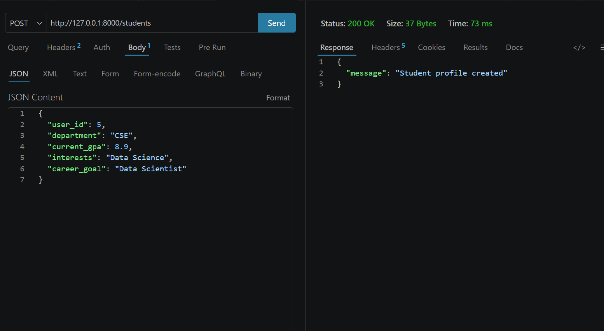

## PUT Student API

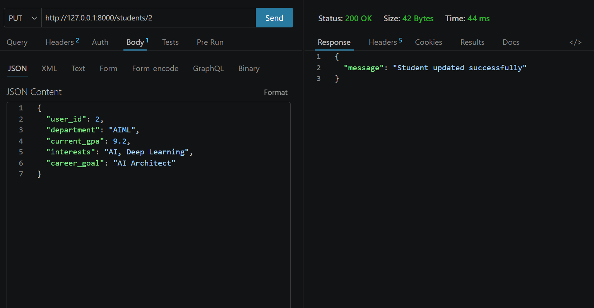

## DELETE Student API

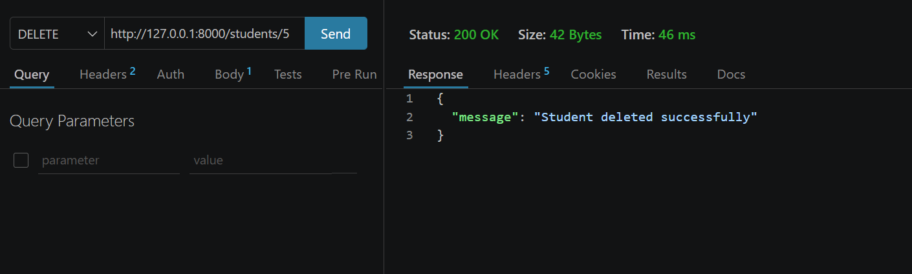

## GET Course API

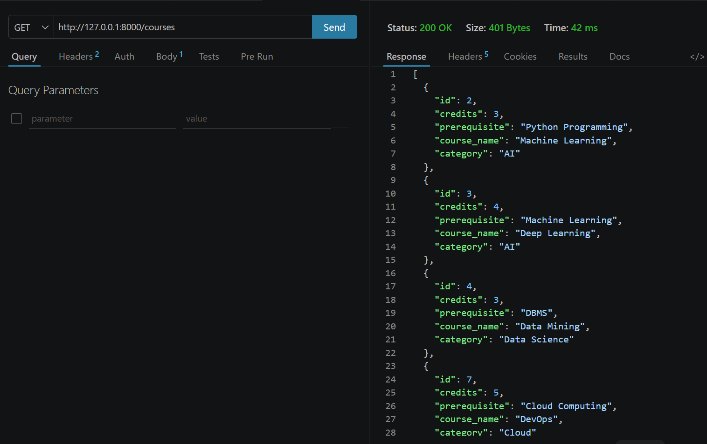

## POST Course API

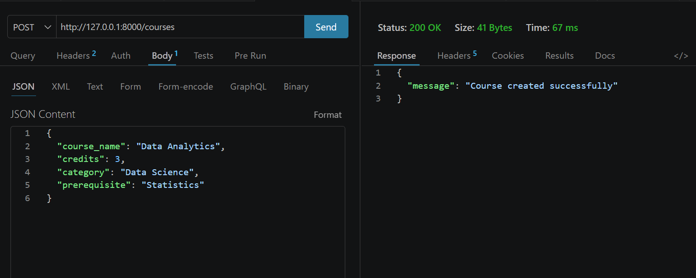

## PUT Course API

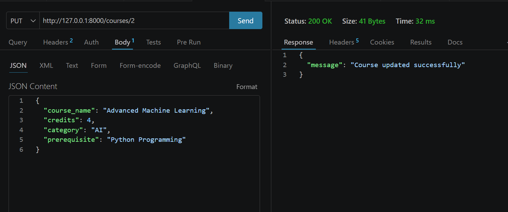

## DELETE Course API

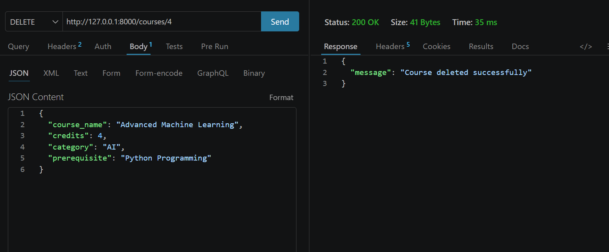

## Team Members

| Name                    | Roll Number |
| ----------------------- | ----------- |
| Kundeti Naga Dhashmitha | 241FA04338  |
| Adusumalli Bhargavi     | 241FA04340  |
| Vadde Bhuvana Teja      | 241FA04341  |

---

## Institution

Vignan University

Department of B.Tech

Academic Year: 2025-2026

---

## Project Guide

Faculty Advisor

K. Rajashekar

---

## License

This project is developed for academic and educational purposes.
